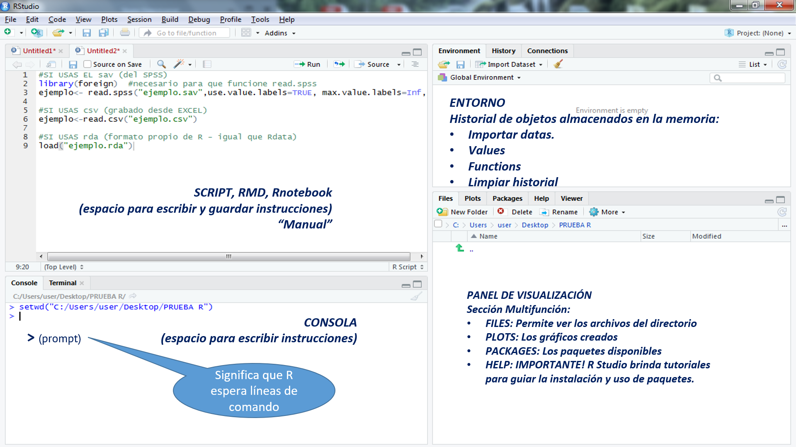
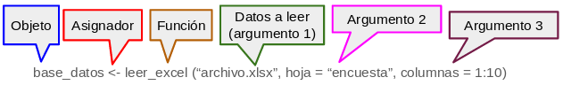
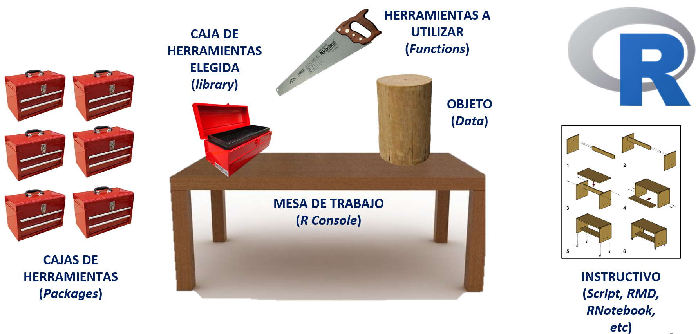

```{r,echo=FALSE, out.width="65%",fig.align="center"}
  # Para plotear cualquier imagen
# Puedes centrar, aumentar o disminuir el tamaño del gráfico (buscar códigos en internet) 
```

¿Qué buscamos con el taller?
============================================================

- Familiarizarnos con el lenguaje, el uso de R y explorar los formas más comunes y útiles para el análisis de datos.

- No es un curso exhaustivo que cubra todas las aplicaciones y posibilidades que se pueden aprovechar con R.

- Proyecto final del taller:

  - Ejemplos...

    - En Github: [Influencia de variables económicas-sociales en la cantidad de protestas a nivel mundial](https://krlos20203563.github.io/Proyecto-Grupal-Estadistica-para-el-Analisis-Politico-2/)

    - En Rpubs: [¿Los países productores de petróleo son los Estados más contaminantes?](https://rpubs.com/LuchoValverde/920711)

Repasemos la instalación de...
============================================================

  - [**R y Rstudio**](https://luccemhu.github.io/)
  
```{r,echo=FALSE,fig.show="hold", out.width="50%",fig.cap="Íconos de R y Rstudio, respectivamente"}

```

## Otra opción es RStudio Cloud

Esta plataforma se define como un Cloud computing. Es decir, el hardware, software, datos y recursos que utilizas para tus cursos de estadística pasan de estar en nuestras computadoras a “la nube”.

  - [Pueden crearse una cuenta en el siguiente enlace de Posit Cloud: **Log in or Sign Up**](https://login.posit.cloud/register?redirect=https%3A%2F%2Fclient.login.posit.cloud%2Foauth%2Flogin%3Fshow_auth%3D0%26show_login%3D0)
   
    - [Para profundizar revisen el siguiente enlace: **Rstudio Cloud: Primeros Pasos**](https://www.youtube.com/watch?v=whBz89WoxPY)

Configurar el directorio de trabajo
============================================================

- Es fundamental considerar la ubicación de los archivos al importar y exportar nuestros datos. Esta carpeta, en la que se cargan los archivos, se conoce como "Working directory" o directorio de trabajo.

- Para encontrar nuestro lugar actual de trabajo o el "Set Working Directory", debemos correr el siguiente comando en la consola: `getwd()` (sin las comillas invertidas). Si ejecuta este comando desde un archivo Rmd, obtendrá la ubicación del archivo script actual.

- Para cambiar nuestro directorio de trabajo a uno específico, podemos utilizar la siguiente función:

````markdown
setwd() # Establecer el nuevo directorio
dir() # Ver qué archivos están en el directorio o en el lugar en que se encuentre
````

- Otra opción para establecer nuestro directorio de trabajo:

  - Nos dirigirnos al menú superior y seleccionamos las siguientes pestañas: “Session” \> “Set Working Directory” \> “Choose Directory”. Esto abrirá una ventana emergente, en la que podemos buscar la carpeta en la cual deseamos trabajar. Una vez ubicada, la seleccionamos y hacemos clic en "Open". Para verificar el cambio, volvemos a ejecutar la función `getwd()` en la consola.

- Si necesitamos importar, por ejemplo, una base de datos desde otra subcarpeta (dfs, en este caso):

````markdown
library(rio)
data = import("./dfs/pavimentandoconvotos.sav") 
# './' El punto + el slash indican que importaremos 
# la base de una subcarpeta llamada 'dfs'
````

- Luego aprenderán otros modos para importar bases de datos directamente desde internet.

¿Qué es R?
============================================================

R es un lenguaje y software que permite análisis estadísticos y gráficos.

  - Lenguaje porque posee su propia sintaxis, a partir de la cual se pueden escribir sentencias y comandos.

  - Es un software porque es al mismo tiempo un programa con múltiples funcionalidades

## ... ¿Y RStudio?

Rstudio es un integrated development environment - [IDE](https://posit.co/products/open-source/rstudio/): un interfaz amigable y poderoso para trabajar con R.

Pero si hay más softwares estadísticos, ¿por qué usamos (o deberíamos usar) R?
============================================================

- Costo: Software libre

- Potencia (N° herramientas): Comunidad que crea nuevas herramientas (packages) constantemente.

- Accesibilidad al usuario: Lenguaje de Programación R (Antes de 1970)

- Versatilidad: Muchas extensiones: [GIS](https://mappinggis.com/2019/02/r-y-gis-que-es-r-y-su-relacion-con-los-sig/), [Quarto](https://quarto.org/), etc.

## ¿Pará qué podemos usar R?

Proporciona una amplia variedad de herramientas para generar visualizaciones y personalización de gráficos de datos de alta calidad, además, junto con Rstudio permiten la automotización de reportes y la replicabilidad de los análisis mediante el uso de scripts.

- Pero también...

  - Es una herramienta de procesamiento estadístico: limpieza, manejo, almacenamiento de datos e integración con distintas bases de datos o lenguajes de otros programas (Spss, Python o Stata)

  - Amplia variedad de técnicas estadísticas para el análisis de datos: modelos lineales, pruebas estadísticas, análisis de series de tiempo, clasificación, agrupación, enter otros.

  - Posibilidad de creación de librerías propias para trabajos en específico

  - Implementar análisis con algoritmos de Machine Learning, data mining y big data. 
    
  - Web Scraping, generar tableros o aplicaciones como shiny

- *Después de lo que se ha expuesto, les animo a que continúen explorando R y sus diversos usos a través de diferentes fuentes, siendo este curso una de ellas.*

**INTERFAZ**
============================================================

- **4 paneles (en esentido horario):**

```{r, echo = FALSE, out.width = "115%", fig.align = "center", fig.cap="Fuente: Benites, A... & Rodríguez, A. (2022). PPT curso de POL278 - Estadística para el análisis político 1 - 2022-1"}
 
```

**1. Console (La consola)**

- Útil cuando queremos ejecutar porciones de código pequeñas.

- Realizar cálculos y operaciones matemáticas como una calculadora avanzada.

- Visualizar y registrar el output de nuestros códigos

**2. Script (El editor)**

Panel en el que se crean y modifican scripts, entre otros tipos de archivos...

  - Por ejemplo, para crear un script de extensión .R: vamos a File \> New File \> R Script. 

  - Para abrir un script guardado en la computadora, vamos a File \> Open File

**2.1. knitting en RStudio**
    
Vamos a trabajar en archivos con extension Rmarkdown (Rmd) y otros, pero para presentarlos de una manera amigable, podemos exportarlos en formato PDF, Html o en una página web.

- Para Html, seleccionamos en el menú Knit \> Knit to html

- Para pdf, seleccionamos Knit \> Knit to PDF, pero antes de exportar en pdf deberá instalar lo siguiente desde su consola:

  - install.packages(‘tinytex’)

  - tinytex::install_tinytex()

- Asimismo, para un Knit a una página web, utilizaremos [Rpubs](https://rpubs.com/users/new), por lo que deberán crearse una cuenta. 

   - Recomendación: Cuando creen sus archivos Rmd, que estos no contengan en su nombre caracteres como tildes, símbolos, etc., eso no les permitirá realizar un knit en la web.    
    
- Diferencias sobre este tipo de archivos: [Script, R Markdown y R Notebook](https://www.youtube.com/watch?v=y7JPGlw6dJg)

- Puedes revisar este Rpubs de [Gustavo Martínez Valdes para mejorar tu **YAML**](https://rpubs.com/gustavomtzv/874870):

    - YAML (Yet Another Markdown Language): Allí se configuran las características generales que se arrojarán en el documento de salida o output, una vez que el documento en formato Markdown haya sido renderizado (con el comando `knitr()`).

**2.2. Github**

Vamos a requerir que se creen una cuenta en GitHub. Esta plataforma permite alojar proyectos utilizando el sistema de control de versiones Git. Se utiliza principalmente para la creación de código fuente de programas de ordenador. Para fines de este curso, vamos a utilizar Github como repositorio para cargar nuestras bases de datos, administrar nuestros archivos etc.

  - [Pueden crearse una cuenta en el siguiente enlace de Github: **Log in or Sign Up**](https://github.com/).

- Github como repositorio:

    - En la parte superior derecha seleccione “+”, seleccione “New repository” y siga los pasos precisando el nombre del respositorio, descripción (opcional), elija la visibilidad del repositorio (publico o privado) y cree su repositorio.

    - Cargue archivos seleccionando Add file \> Upload files \> Choose your files \> Commit changes

       - [Para profundizar más, visiten este tutorial: **Integración entre RStudio y GitHub**](https://www.youtube.com/watch?v=te1fJgn71js) y la [**parte 2**](https://www.youtube.com/watch?v=vuvp_-cPYNA)

**3. Environment (El entorno de variables)**

-   Advertimos los objetos creados, pero tambien dataframes, tibbles, listas, entre otros.

    - ¿Qué es una variable?

       - Una variable es un espacio en la computadora en el que guardamos un objeto (como una caja con un nombre determinado para guardar cosas).

**4. Panel de Visualización**

Se encuentran los archivos del usuario como si fuera la carpeta de "Mis Documentos" en Windows. De esta manera podemos acceder fácilmente a archivos de nuestra computadora y de nuestro directorio de trabajo.

**5. Menú superior**

    - File
    - View: Zoom in, Zoom out
    - Session
    - Tools
    - Entre otros

Configuremos RStudio!
============================================================

Solo algunos cambios para iniciar...

- 1) Nos dirigimos al menú superior: "Tools" \> "Global options..." \> "Code"...

    \> "Display" \> y marcamos lo siguiente: 
    
    -   "Show line numbers"
    
    -   "Highlight R funtion Calls"
   
    -   "Rainbow parentheses"

    \> "Saving" y cambiamos en "Default text encoding:" a "UTF-8"

- 2) Luego nos dirigimos: "Tools" \> "Global options..."

    \> "Appereance" \> y marcamos lo siguiente:

    -   RStudio theme: Modern

    -   Zoom: 175%

    -   Editor font: Lucida Font

    -   Editor font size: 10

    -   Editor theme: Pastel On Dark

**Ojo: podemos realizar estos cambios y otros según nuestra curiosidad o interés.**

Pero también es importante mejorar nuestros reportes...
============================================================

- Tomemos en cuenta la siguiente sintaxis de Rmd:

  - **bolding words** <- negrita

  - *italicizing words* <- cursiva

  - ~~striking through~~ <- tachando

    - Puedes combinar las anteriores: ***Cuantipol***

  - 'comillas simples' <- alt + 3 + 9 <- ''

  - `comillas invertidas` <- alt + 9 + 6 <- ``

  - Para escribir una nueva oración, debemos dejar una linea de código para que no se junte todo en un solo párrafo.

``` markdown
# Título

## Subtítulo
 
###
```

  - Realizar comentarios de los comandos en el code chunk o en el script con la almohadilla o el numeral: #

    - Por ejemplo: Importemos los nombres del dataset starwars:
    
```{r, message=FALSE}
library(tidyverse)  # Necesario para llamar al dataset
# Sin este numeral, no se podría comentar 
# ni ejecutar los códigos en este code chunk
names(starwars) 
```

En ese sentido, para programar de manera ordenada, es de utilidad comentar el código utilizado y proporcionar una explicación precisa de lo que se realiza con cada función. Esto no solo nos ayuda a nosotros mismos a entender claramente el propósito de cada función cuando volvamos a revisar nuestro código, sino que también resulta útil para nuestros colegas que revisarán nuestra investigación.

Es necesario comentar que los primeros lenguajes de programación tienen una fuerte influencia anglosajona. En 1963, se creó el código ASCII, un conjunto de caracteres basado en el alfabeto latino utilizado en el inglés moderno [(Mackenzie, 1980)](https://archive.org/details/mackenzie-coded-char-sets). En consecuencia, las primeras computadoras IBM adoptaron el estándar ASCII. Esto puede provocar dificultades en la lectura de caracteres especiales como "ñ", "ó" o "ü". Por tanto, al manipular datos, debemos considerar lo siguiente:

-   Guardar los objetos con nombres cortos, autodescriptivos, sin espacios y sin caracteres especiales. Del mismo modo con las variables dentro de los objetos.

-   Al exportar los datos, verificar si los nombres de los objetos y las variables dentro de ellos se han exportado correctamente, sin problemas de codificación ("*encoding*"). Por ejemplo,  al exportar a formato `.dta`, los nombres de las variables podrían aparecer de la siguiente manera:

    | variable   | variable en `.dta` | Correcto nombre de variable |
    |------------|--------------------|-----------------------------|
    | año        | a?o                | year                        |
    | educación  | educaci?n          | edu                         |
    | antigüedad | antig?edad         | antiguedad                  |

Consideremos otros consejos respecto a los code chunk:
============================================================

Nota: para advertir los cambios, es necesario comparar el script y el informe.

```{r}
# Code chunk básico
```

- Código para no mostrar las advertencias y mensajes para todo nuestro reporte:

```{r setup, include=FALSE}
knitr::opts_chunk$set(warning = FALSE, message = FALSE)

```

- Lo anterior, pero solo para un code chunk:

  - Ojo: include = FALSE <- No muestra el código ni su resultado ni texto, etc., en el reporte. 

```{r, include =FALSE,message=FALSE,warning=FALSE}

```

- Si solo queremos visualizar el resultado, pero no el código:

```{r, echo =FALSE,message=FALSE,warning=FALSE}
# echo = FALSE <- No muestra el código, pero sí su resultado
# (conveniente para gráficos, mapas, etc.) 
# Por ejemplo:
plot(cars)
```

- Para mostrar el código, los gráficos, etc., y el resultado de su función:

  - eval=TRUE
```{r,eval=TRUE,message=FALSE,warning=FALSE}
# Compruebalo al Knitear este informe:
#library(scatterplot3d)
#(f <- scatterplot3d(airquality[,c('Ozone', 'Wind', 'Month')]))
```

- Para mostrar el código, los gráficos, etc., pero no el resultado de su función:
  
  - results=FALSE
```{r, results =FALSE,message=FALSE,warning=FALSE}
# Por ejemplo:
library(scatterplot3d)
(f <- scatterplot3d(airquality[,c('Ozone', 'Wind', 'Month')]))
```

Atajos útiles de teclado, los más importantes...
============================================================

Podemos ver todos los atajos en el **Panel de atajos**: tools \> Keyboard Shortcuts Help \<- alt + shift + k

- **Crear code chunk** <- Ctrl + Alt + i

- **Correr/ejecutar code** <- Alt + Enter

- **Guardar avance** <- Ctrl + S

- Ejecutar linea de código <- Ctrl + Enter

- Knitear/renderizar a pdf/hml/etc <- Ctrl + Shift + k

- Dar formato ordenado al código <- Ctrl + A

- Para comentar múltiples líneas de código en un chunk: agrega el numeral al lado izquierdo en cada línea de código <- Ctrl/cmd + Shift + C

- Para buscar y reemplazar varias palabras <- Ctrl + F

- Reiniciar Rstudio <- Ctrl + shift + f10

- Insertar 'pipe' <- Ctrl + shift + m <- `|>` o el pipe antiguo: %>%

- Operador de asignación <- Alt + - (guion) o también podemos usar: <-

- Arrastrar línea de código <- Alt + up o Alt + down

- Para desplazarnos en cada pestaña de los scripts <- Ctrl + Alt + (flechas: izquierda o derecha)

- Para insertar/crear secciones (títulos) <- Ctrl/cmd + shift + R

**Instalación de paquetes**
============================================================

Para instalar un paquete solo debes correr el siguiente comando con el nombre del paquete dentro del paréntesis entre comillas. 

```{r}
#install.packages("tidyverse")
```

- Cuando instalas un paquete estás descargando una serie de funciones con un solo comando.

- Recuenden: Los comandos en R tienen que estar con los espacios, comas, comillas, paréntesis y puntos exactamente de cierta forma , sino el comando no correrá! Es recomendable correr este comando en la consola porque solo se tiene que descargar un paquete una vez por lo cual si dejas el comando en tu script se podría volver a correr reinstalando un paquete instalado.

En efecto, esto va a suceder otras veces con todos los paquetes que quieras instalar y abrir. Ya que puedes ya tener el paquete descargado pero si no lo abres con el comando `library`, no podrás utilizar sus funciones. 

Otra opción es abrir solo el o los paquetes que necesitas usar ya que abrir el paquete de tidyverse a veces demora un poco debido a que son varios paquetes.

```{r}
library(dplyr)
library(ggplot2)
library(tidyr)
library(purrr)
library(knitr)
```

Pero el paquete {pacman} nos permite realizar ambas acciones al mismo tiempo de la siguiente manera:

- Instalar el paquete pacman en la consola:

    install.packages("pacman")

- Luego correr en un code chunk lo siguiente:

```{r}
# instalar e invocar paquetes:
pacman::p_load(dplyr, ggplot2, tidyr, purrr, knitr) 
# Hicimos todo lo anterior solo en una linea de codigo.
```

Algo más: Organización de carpetas
============================================================

Es importante conservar un orden para realizar análisis de datos o una investigación. Se sugiere la siguiente estructura:

-   Nombre de la carpeta principal

    -   códigos

    -   datos

        -   original
        -   procesados

    -   resultados

        -   tablas
        -   gráficos
        -   Htmls, Pdfs, etc

    -   literatura

Les exhorto revisar los foros de la comunidad de programadores como [StackOverflow](https://stackoverflow.com/) en la que se realizan y absuelven dudas frecuentes o específicas.

**Elementos fundamentales**
============================================================

## **Sintaxis en R**

Hasta ahora, parece que toda la acción es consecuencia de haber corrido un código. En fecto, casi todo está compuesto por códigos y la combinación de estos forma una sintaxis. Además, R almacena la información de nuestras observaciones y variables en objetos. En ese sentido, la estructura general de una sintaxis puede resumirse de la siguiente manera: 

- A un objeto determinado se le asigna el resultado de una función, que a su vez se ejecuta sobre un conjunto de datos especificado, con una serie de configuraciones particulares. 

  - Por ejemplo:
```{r,echo=FALSE, out.width="90%",fig.align="center", fig.cap="Fuente: Benites, A... & Rodríguez, A. (2022). PPT curso de POL278 - Estadística para el análisis político 1 - 2022-1"}

```

Entonces, la línea de comando puede explicarse así (de izquierda a derecha):

-   Primero se indica un objeto a crear, con el nombre que ustedes definan.

-   Luego se indica el asignador, que expresa que todo lo que esté a la derecha de la flecha se guardará en el objeto creado a la izquierda. El asignador puede ser "<-" o también "="

- A continuación, encontramos la función que, en este caso, nos permite leer archivos de tipo Microsoft Excel. 
Notemos que R utiliza funciones que están disponibles en "paquetes" desarrollados por la comunidad. Podemos realizar nuestras operaciones utilizando diferentes funciones, ya que no existe una única forma de hacerlo. Si deseamos utilizar funciones que no están incluidas por defecto en R, debemos instalar el paquete y cargar la libreria respectivos para ejecutarlas.

- Luego de la función, se abre un paréntesis que contiene los argumentos: instrucciones que especifican ciertos detalles de lo que queramos que la función realice. Los argumentos pueden escribirse de distintas maneras y va a depender de lo que queramos hacer. En nuestro ejemplo:

    - El primer argumento indica la información a leer, en este caso indica un archivo de tipo Excel (extensión xlsx). 

    - El segundo argumento indica la hoja del archivo a leer. 

    - El tercer argumento indica qué columnas se leerán de forma específica (en este caso, las primeras diez).

## **Valores**

Es el elemento más básico que existe en el entorno de R

  - Son valores numéricos:
  
```{r}
3
9*5 
7+6
```

  - Son valores character:
  
```markdown
"mes"
"un mes"
```

  - FALSE es un valor booleano o lógico
  
```{r}
7+6 > 45
```

### **Vectores**

Recordemos los vectores en matematicas o física: 

  - Algo que tenia magnitud o modulo, direccion y sentido, y que los componentes de un vector se guardan en coordenadas:
  
    - Una cosa como (x,y,z)

Un vector es un espacio de memoria en la computadora que se usa para guardar informacion de cualquier cosa. Efectivamente, **los vectores son una colección de valores**.

Para agrupar esos valores utilizamos el comando c()

  - Así es, `c` ya es una función en R, y si crea una variable con el mismo nombre, significaría que ya no se podría usar `c()` para combinar/concatenar elementos. 
  
Estos vectores también pueden ser de distinto tipo:

```{r}
c(9, 9*5)
c("mes", "un mes")
c(9*5, "mes")
```  

## **Objetos**

- Notar que ninguno de los valores ni vectores anteriores fueron almacenados en un objeto. Si quisiera llamarlos, ¿cómo haría?

- Debo definirlos, especificando tres inputs:

  - nombre del objeto

  - utilizar el operador asignación <- (pensarlo como un =)

  - contenido  
  
```{r}
a <- 7 + 6
a
```  
  
En el ejemplo anterior, se ha creado un objeto `a` y luego se ha llamado ese mismo objeto para que muestre lo que lleva adentro (13). 

Ahora, crearé el objeto `b`:

```{r}
5 + 1 -> b 
b
```  
  
El objeto `a` y `b` son vectores numéricos por lo que puedo realizar operaciones entre ellos. En primera instancia puedo sumarlos entre ellos y/o con otros números:

```{r}
h <- a+b
h
```

```{r}
a + b + 6
```  
  
¿Pero hay más tipos de vectores?... 

### **Tipos de objetos en R**

Una parte clave para iniciar el manejo del programa es identificar los diversos objetos que podemos crear, manipular y utilizar. Para la definición de objetos en R será necesario previamente tener claridad teórica sobre lo que es una variable categórica nominal, categórica ordinal, numérica discreta y numérica continua.

    | Nombre   | Ejemplo | Name      |
    |----------|---------|-----------|
    | Entero   | 1	     | Integer   |
    | Numérico | 1.8     | Numeric   |
    | Caracter | "uno" 	 | Character |
    | Factor   | uno     | Factor    |
    | Logico   | TRUE    | Logical   |
    | Perdido  | NA      | Missing   |
    | Vacío    | NULL    | null      |


- Del mismo modo para los vectores:

  - Definir un objeto me permite luego llamarlo para distintas operaciones (lo que se conoce como vectorización)

R se conoce como un lenguaje vectorizado y las estructuras de datos básicas en R son todas vectores. Por ejemplo, cuando creamos la variable `h` anteriormente, parecía que era solo un número entero e integer. Pero en realidad, R almacena esto como un vector – una lista ordenada de elementos del mismo formato (en este caso, [double values](https://r-coder.com/tipos-datos-r/#:~:text=El%20tipo%20de%20datos%20double,de%20n%C3%BAmeros%20tambi%C3%A9n%20son%20doubles.)).

Podemos ver el tipo de los elementos en un vector usando la función typeof, y podemos ver cuántos elementos hay en el vector usando la función length:

```{r}
typeof(h) # Tipo de los elementos
length(h) # Cuantos elementos hay en el vector
```

## **Vector numérico**

- Vector conformado por la concatenación de números, puede representar variables numéricas continuas o discretas. Ej: 1.5, 2.7, 3.1 

Como vimos anteriormente, un vector numérico se compone de uno o más números lo que nos permite realizar operaciones aritméticas. Por ejemplo:

```{r}
#un número=3
g <- 1 + 2
#dos números=c(1,2)
d <- c(1, 2)
#c es un vector numérico
class(g)
```

Cuando tenemos un vector con más de un número, las operaciones aritméticas que realizamos se aplican a cada uno de sus elementos:

```{r}
#Cada elemento de d x 2
d*2
```

```{r}
vect0 <- c(1, 3, 4)
vect0

vect1 <- vect0 + 12
vect1 # Los vectores se suman en parelelo

vect2 <- vect0 + (12:14)
vect2 # Los vectores se suman en parelelo
```

## **Vector de caracteres** / vector de factores

Vector que sirve para representar variables categóricas. Pudiendo ser factores nominales u ordinales. 

- Ej:

  - "costa", "sierra", "selva".
  
  - Género: Masculino, femenino 
  
  - Nivel de confianza en instiuciones: muy alto, alto, bajo

Por ejemplo:

```{r}
cuan1 <- "genteeeeeee,"
cuan2 <- "ahora, sí se acabó el recreo"
cuanti <- paste(cuan1, cuan2)
print(cuanti)
```

En un vector no se permite que se realicen operaciones aritméticas; no obstante, podríamos calcular la frecuencia con que se repite cada elemento. Por ejemplo:

```{r}
ejemplo <- c("Y", "la", "queso", 3,
             "Y", "la", "queso", 3,
             "Y", "la", "queso", 3)
ejemplo
class(ejemplo)  
```

El objeto `ejemplo` es un vector "character" que engloba texto únicamente, por lo que podemos contabilizar cuántos elementos repetidos tiene:

```{r}
table(ejemplo)
```

Nótese que aunque se ha incluido un número a propósito (el 3) dentro de un vector con texto, igual reconoce este número como un texto. En este caso, se podría hacer la equivalencia: `3="3"="tres"`. Es por ello que cuando realizamos una tabla de frecuencias contabiliza cuántos 3 hay en vez de sumar los tres 3s.

#### **Ya pero, ¿qué son los factores en R?**

  - Una estructura de datos para manejar variables categoricas. 

  + Las **variables categóricas** son datos que toman una cantidad finita de valores
  
  + Por ejemplo:
  
    - Rango de edad: niño, joven, adulto
    - Colores: rojo, verde, amarillo, ...
    - Días de la semana: L/M/M/J/V/S/D
    - Entre otros...

  + En analisis de datos, las variables categoricas se tratan de manera diferente a las variables continuas o numericas.
  
  + Necesitamos un objeto en R para ello. Los factores permiten trabajar con modelos y graficas de variables categoricas (aquí su importancia).

## **Vector lógico**

Un objeto lógico es un vector booleano dicotómico cuyos valores pueden ser únicamente `TRUE` o `FALSE`. Por ejemplo:

```{r}
resultados <- c(TRUE, TRUE, FALSE, FALSE)
class(resultados)
```

Los vectores lógicos son útiles cuando se trabaja con condiciones lógicas del tipo `if else`. Por ejemplo:

```{r}
# una abreviación para TRUE es T y para FALSE es F
aprueba_examen = T
reprueba_examen = F

# if(vector lógico){en caso TRUE}else{en caso FALSE}

if(aprueba_examen) {"Felicitaciones"}else{"Más suerte a la próxima"}

if (reprueba_examen) {"Felicitaciones"}else{"Más suerte a la próxima"}
```

Pero tambien podemos utilizar tipicos operadores matematicos para comparar valores. El simbolo del doble igual comprobara si, por ejemplo, estos dos valores son iguales. Mientra que el signo del mayor que comprobara si una variable lo es, efectivamente, sobre otra:

```{r}
aprueba_examen == reprueba_examen 
aprueba_examen > reprueba_examen 
```  

Se cuenta con diferentes **operadores lógicos**, como se muestra en la siguiente tabla:

| Operator | Meaning                                                                                                                                                                                        |
|-----------------------|-------------------------------------------------|
| `x & y`  | Devuelve `TRUE` solo si `x` es `TRUE` **and** `y` es `TRUE`                                                                                                                                    |
| `x | y`  | Returns `TRUE` only if `x` is `TRUE` **or** `y` is `TRUE` (or both are!)                                                                                                                       |
| `!x`     | Llamado **not**, este operador voltea todos los elementos `TRUE` en `x` a `FALSE` (y viceversa)                                                                                                |
| `x == y` | Returns `TRUE` if x is equal to y. Watch out! We use two equal signs to check if numbers are the same, not a single equal sign.                                                                |
| `x < y`  | Returns `TRUE` if `x` is less than `y`. If you want to see if `x` is less than or equal to `y` you can use **`<=`**, and the reverse of these two operators, `>` and `>=`, also are available. |


### Podemos emplear el comando `class()` de forma genérica para conocer qué tipos de datos son...

Por ejemplo:
```{r}
class(8)

class("UNMSM")

class(TRUE) 
```


## **Funciones (comandos)**

Las funciones son comandos, son expresiones que encierran una orden predeterminada.

- Al invocar una función le estaremos diciendo a R que realice una tarea particular.

- Para ejecutar una función R necesita de dos inputs:

    - Nombre de la función
    - Argumento


##  **Data Frames (base de datos)**

  - En ese caso, basado en vectores
  
Es una estructura de datos en la que se utilizan diferentes tipos de variables o vectores que constituyen una matriz. Entonces, encontramos columnas con caracteres, numeros y variables logicas. 
  
- Son importantes para graficas, analisis y modelos con muchas variables estadisticas

Por ejemplo:

```{r}
df <- data.frame(
  persona = c("Joel", "Santiago", "María Pía", "Pavel"),
  nota = c(15, 17, 20, 16),
  aprueba = c(F, T, T, T))
df
```

En este dataframe de valores aleatorios podemos ver que tenemos los tres tipos de vectores = character, numérico, y lógico. Cabe mencionar que deben haber el mismo número de valores dentro de cada vector, es por ello que, cada vector cuenta con 4 valores.

Asimismo, un dataframe nos permite generar variables a partir de los valores de otras variables presentes en el dataframe. Por ejemplo:

```{r}
df$mensaje <- ifelse(df$aprueba,
                       "Felicitaciones",
                       "Más suerte a la próxima")
df
```

#### Pero en este curso, comúnmente, también encontraremos y, a veces, crearemos:

- lists, que parecen vectores pero tienen elementos de diferentes tipos

- functions, que se denominan closures (cierres) en R y operan con datos

- Entre otros

Programando en R
============================================================
```{r,echo=FALSE, out.width="115%",fig.align="center", fig.cap="Fuente: Benites, A... & Rodríguez, A. (2022). PPT curso de POL278 - Estadística para el análisis político 1 - 2022-1"}
 
```

**Referencias**:

-   Mendoza, B. (2018). R para principiantes. Libro electrónico. En https://bookdown.org/jboscomendoza/r-principiantes4/

-   Hanck, C., Arnold, M., Gerber, A., & Schmelzer, M. (2019). Introduction to Econometrics with R. University of Duisburg-Essen, 1-9. En https://www.econometrics-with-r.org/

-   Mackenzie, Charles E. 1980. Coded character sets: history and development. Reading, Mass:
Addison-Wesley Pub. Co. En https://archive.org/details/mackenzie-coded-char-sets

-   Santiago Sotelo & María Pía van Oordt (2023). Qlab.

-   Tiscornia Pablo - Introducción al procesamiento de datos con R para Ciencias Sociales. Aplicación práctica en la Encuesta Permanente de Hogares (EPH-INDEC). En https://intro-r-eph.netlify.app/bio.html)

-   Weksler, K. & Shokida. Curso de R para procesamiento de datos de la Encuesta Permanente de Hogares. En https://diegokoz.github.io/Curso_R_EPH_clases/

-   Wickham, H., & Grolemund, G. (2016). R for data science: import, tidy, transform, visualize, and model data. " O'Reilly Media, Inc." En [First Edition](https://r4ds.had.co.nz/) y [Second Edition](https://r4ds.hadley.nz/)

**Más recursos**:

-   [Data Política: Manual R para estadística aplicada al análisis político. Data Política: Lima.](https://christianchiroquer.github.io/ManualdeR/r-un-lenguaje-de-programaci%C3%B3n.html)

-   [Messy data](https://tidyr.tidyverse.org/)

-   [Tidy data](https://tidyr.tidyverse.org/articles/tidy-data.html)

-   [The R Graph Gallery](https://r-graph-gallery.com/)

-   [R-Ladies Lima](https://www.youtube.com/c/RLadiesLima/videos?app=desktop&view=0&sort=dd&shelf_id=0)

-   [Data Wrangling](https://www.rstudio.com/wp-content/uploads/2015/02/data-wrangling-cheatsheet.pdf)

-   [Data Transformation](https://github.com/rstudio/cheatsheets/blob/main/data-transformation.pdf)

-   [Stringr](https://posit.co/wp-content/uploads/2022/10/strings-1.pdf)

-   [Tipos de variables y escalas de medición](https://www.odiolaestadistica.com/estadistica-r/tipos-de-variables/)

-   [Por qué las estadísticas inteligentes son la clave para combatir el crimen](https://www.ted.com/talks/anne_milgram_why_smart_statistics_are_the_key_to_fighting_crime?language=es)
